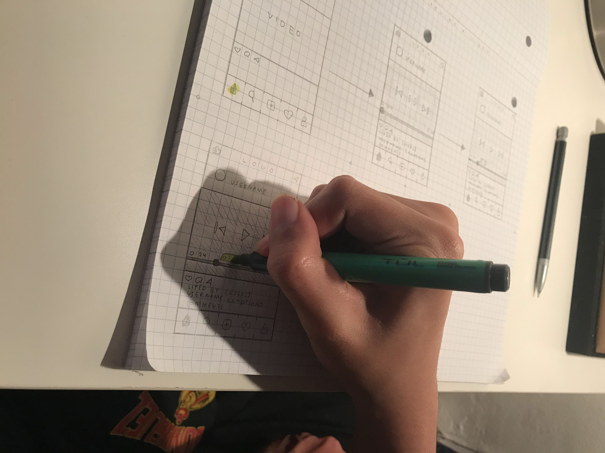

# Low Fidelity Prototype

### DH 150 Assignment 6 by Kimberly Jimenez

---
### Project Description

On Instagram, I observed three problems that could use solving to enhance user experience. The first problem: posts are hard to find on profiles with a large quantity of posts (exceeding 500 hundred). The second problem: the tab “Posts You’ve Liked” is unorganized and too essential to be so hard to access. The third problem: videos on Instagram have no user control options; users are unable to play, pause, forward, or rewind a video. The features incorporated to solve the first problem above includes a search bar and year category tabs incorporated into profiles. To solve the second problem, page numbers (no endless scroll, instead users can view 120 posts per page), number of Likes, and “Posts You’ve Liked” incorporated as a navigation feature. To solve the third problem, a play, pause, rewind, forward, time marker(s), and a scrubber button are incorporated into videos. The purpose of this low-fidelity prototype was to observe whether the newly implemented features were useful and accessible to regular users of Instagram. Furthermore, whether they worked and how the user views the feature. 

---
### Wireframes

Below is a scanned image of wireframe sketches. Please click [here](https://github.com/kj121497/kj5/blob/master/IMG_6321.jpg) to view image of original wireframe sketches.

---
### Wireflows

Task 1 is pictured below.

Task 2 and 3 are pictured below.

---
### Test

Pictures of testing in progress below.

###### Below is Task 1 as I scripted in order to observe whether a user would follow the steps of the feature in my point of view of how that feature should work. 

##### TASK 1: 
Use search bar to search profile posts by date

1. Click on profile icon to view profile
2. Pull down screen so search bar appears
3. Tap on the search bar
4. Enter a date (day, month, year or combination)
5. View and search results

Below are the steps the user took.

1. Identified the feature he was currently in as “Home”, then corrected himself to “Profile” 
2. Thinks the search bar already implemented into the app is the newly implemented search bar to search profile posts
3. Identifies correct search bar and says the search bar works as the following: “Type in a search [keyword] or type in a date” 
4. Then, he says the search bar is “Searching for it [post] and it’s loading”
5. The final step “is the results”

As observed, the user was able to successfully use the feature. He followed most of the steps accordingly. However, he had trouble understanding the search bar would only appear when the screen was pulled down. I believe this is because Wireframe 1 to Wireframe 2 is unable to soundly encapsulate that part of the feature through a sketch. Furthermore, the user was unable to identity the newly implemented search bar, even though it was at the top of the screen on the Profile. I believe this is because users are immediately drawn to the search bar at the bottom of the app. Nevertheless, the user was able to identify the correct search bar in Wireframe 3, as it is more prominent and includes a keyboard pop-up. Aside from the minor hiccups listed above, the user was able to access and use the feature as desired. 

###### Below are Task 2 and 3 as I scripted in order to observe whether a user would follow the steps of the feature in my point of view of how that feature should work. 

##### TASK 2 and TASK 3: 
Forward and rewind a video

1. Find video on feed through “Home” icon
2. Tap on video so play/pause screen appears
3. Use scrubber to forward video ten seconds (2)
4. Use scrubber to rewind video ten seconds (3)

Below are the steps the user took.

1. User notes that, “You click the home page”
2. He identified that the video is playing, but also thinks it was “Liked by people”
3. He identified the video is paused and “went to ten seconds”
4. He identified the video is paused and “went back to fourteen” seconds 

As observed, the user was able to successfully  use two features. He followed all of the steps accordingly. Although, the user did not grasp the fact that the video must be tapped so the play/pause screen appears, he noted that the video was playing. I believe this is because Wireframe 1 to Wireframe 2 is unable to soundly encapsulate that part of the feature through a sketch. Furthermore, the user went out of his way to point out the video was “Liked” by other users, even though that was not part of the Task. Although, the user did not mention the scrubber in either the forwarding and rewinding Task, the user did not the amount of seconds the video was forwarded and reminded. Aside from the minor hiccups listed above, the user was able to access and use the feature as desired. 

---
### Reflection
